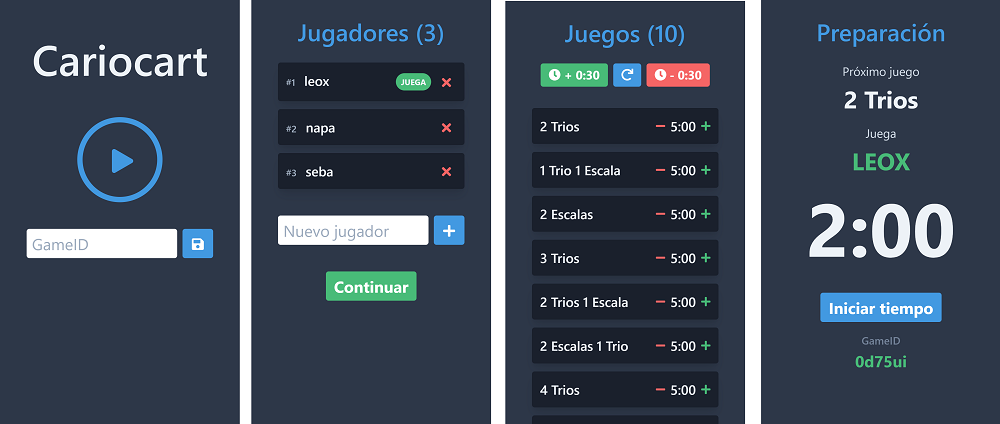
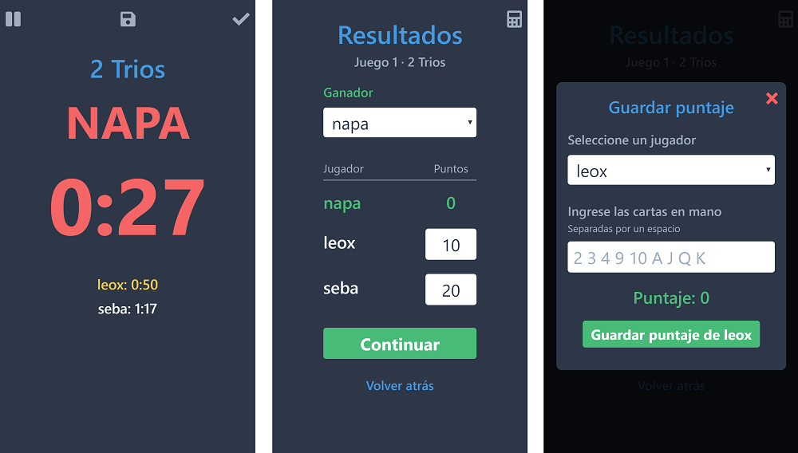
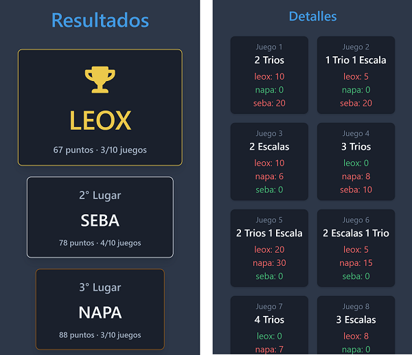

# Cariocart

Carioca es un popular juego de cartas chileno. Con **Cariocart** juega de una manera mas entretenida.

### Ingresa los jugadores, configura los juegos y preparate a jugar.

### Mientras juegas puedes pausar la partida y guardar el juego. Una vez terminada la partida anota los resultados del juego. Opcionalmente puedes usar la calculadora para calcular el puntaje de las cartas que tienes en la mano.

### Ve los resultados de la partida.

