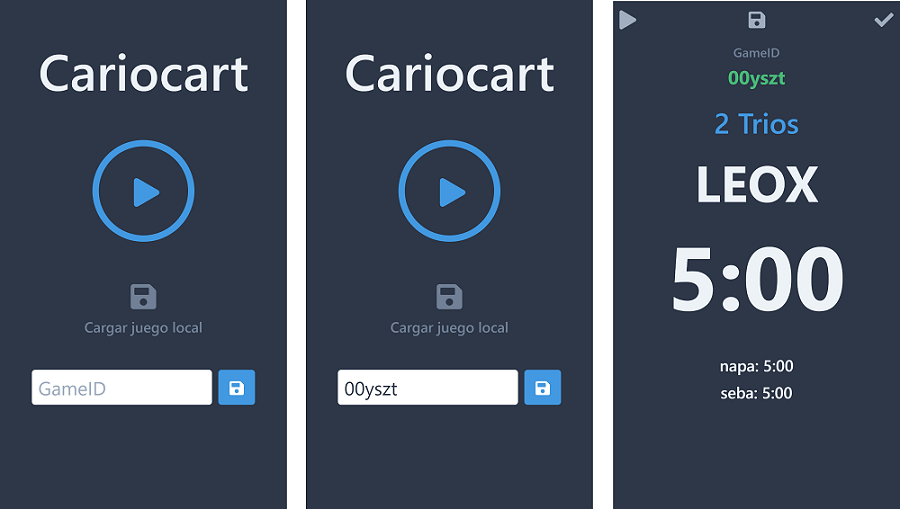
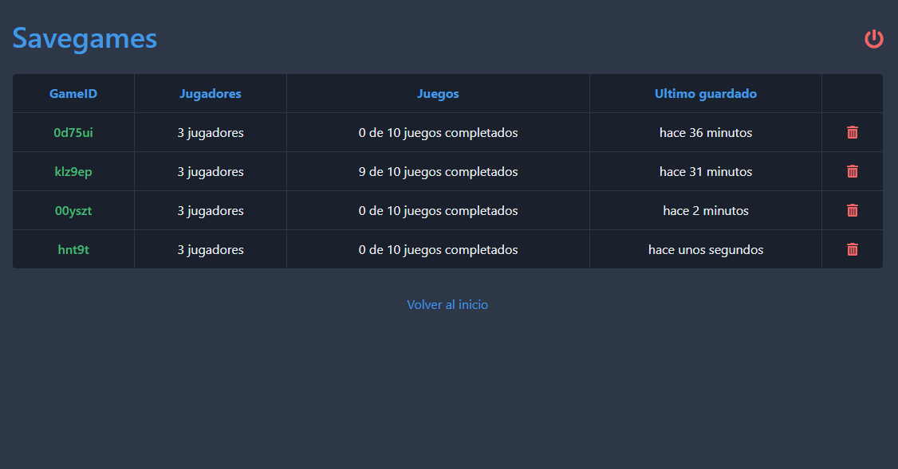

# Cariocart

[Carioca](https://es.wikipedia.org/wiki/Carioca_(juego)) es un popular juego de cartas chileno. Con **Cariocart** juega de una manera mas entretenida.

### Setup
Ingresa los jugadores, configura los juegos y preparate a jugar.   

### In-game
Mientras juegas puedes pausar la partida y guardar el juego. Una vez terminada la partida anota los resultados del juego. Opcionalmente puedes usar la calculadora para calcular el puntaje de las cartas que tienes en la mano.   

### Resultados de la partida
Ve los resultados de la partida y de cada juego individual.   

### Savegames
Carga un savegame guardado en tu dispositivo local o desde otro dispositivo ingresando el GameID   

### Panel de administración
Revisa los juegos guardados desde el panel de administración

* Credenciales:
  * Usuario: username
  * Contraseña: password

### Información importante
Debido a que Heroku Free se reinicia constantemente los datos no persisten mas allá de un día.
